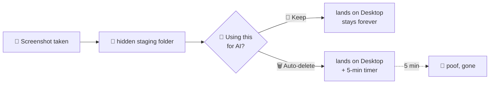

# 📸 screenshot-ai 🤖🗑️

> **Snap → "Using this for AI?" → it cleans up after itself.**

A tiny macOS background helper that intercepts every screenshot and asks one question. Pasting it into Claude / ChatGPT / Codex? Tap **Auto-delete** and it self-destructs in 5 minutes. Keeping it? Tap **Keep** and nothing changes. No uploads, no AI calls, no telemetry — just a prompt and a timer. ✨

<p>
  
  
  
  
</p>

---

## 🤔 Why this exists

If you screenshot stuff to paste into AI chats, those PNGs pile up on your Desktop **forever** — and they often hold things you don't want lingering on disk: 🔐 account pages, 📊 dashboards, 💬 private messages, 🏢 internal tooling.

screenshot-ai adds a one-tap decision *at capture time*:

> 🗑️ **throwaway for AI?** → it cleans itself up
> 📌 **keeper?** → nothing changes

That's the whole idea.

## ⚙️ How it works



1. 🔀 On install, `defaults write com.apple.screencapture location` redirects screenshots from `~/Desktop` to a hidden staging folder (`~/.screenshot-ai/pending`).
2. 👀 A `launchd` agent runs a small bash watcher (`screenshot-ai.sh`) that polls the staging folder ~10×/sec.
3. 💬 When a new `.png` / `.jpg` appears, it waits for the file to finish writing, then shows a native dialog with two buttons: **Keep** and **Auto-delete**.
4. 📥 Either way the file moves to `~/Desktop` so it behaves like a normal screenshot. If you picked auto-delete, the deletion time is written to a tiny state file (`~/.screenshot-ai/deletes.tsv`) and a notification confirms the timer.
5. 🧹 On every poll tick the watcher sweeps `deletes.tsv` and removes anything that's due. Because the schedule lives **on disk** (not in a spawned timer process), pending deletes survive reloads, logout, and reboots.

The watcher is plain bash shelling out to `osascript` — nothing to compile, no toolchain. 🪶

## 📦 Requirements

- 🍎 macOS 12+ (uses `osascript`, `launchd`, `defaults`, `stat -f%z` — all stock)
- 🚫 No external CLIs needed for the core watcher.
- 🦅 *Optional:* Xcode Command Line Tools (`swiftc`) to build the paste-on-cursor helper. Without it, Keep/Auto-delete still work.

## 🚀 Install

```bash
cd ~/Documents/screenshot-ai
chmod +x install.sh uninstall.sh screenshot-ai.sh
./install.sh
```

> 🔓 The first time the dialog or notification fires, macOS may ask to grant Automation / System Events permission. Approve it (System Settings → Privacy & Security → Automation).

## 🎬 Use

Take a screenshot the usual way:

| ⌨️ Shortcut | 🎯 Behaviour |
| --- | --- |
| `Cmd+Shift+3` | Full screen → staged → prompts you → moved to `~/Desktop` |
| `Cmd+Shift+4` | Region → staged → prompts you → moved to `~/Desktop` |
| `Cmd+Shift+5` | Capture UI → staged → prompts you → moved to `~/Desktop` |
| `Cmd+Ctrl+Shift+3 / 4` | Clipboard only — **not intercepted** (never hits disk) |

Then the dialog: 👇

- 📌 **Keep** — behaves like a normal screenshot. Stays on the Desktop until you delete it.
- 🗑️ **Auto-delete** *(default)* — the screenshot **jumps onto your cursor** 🖱️ — move it (no button held) over your AI tool's chat box, **click to paste it** ✨, or hit **Esc** to skip. Either way it then vanishes after `SCREENSHOT_AI_TTL` seconds (default 300 = 5 min).

### 🖱️✨ Paste-on-cursor (the `cursorpaste` helper)

When you pick **Auto-delete**, a small thumbnail of the screenshot sticks to your mouse pointer and follows it around — no button held. Move it wherever you want to use it and **click once** to drop it in (it copies the image to the clipboard and sends ⌘V into whatever you clicked), or press **Esc** to dismiss without pasting.

This part is a tiny native Swift helper (`cursorpaste.swift`, built to `~/.screenshot-ai/bin/cursorpaste` by `install.sh`). It's **optional** — if Swift isn't available or the build fails, Keep/Auto-delete still work, you just don't get the floating paste.

> 🔐 First time you use it, macOS will ask to grant **Accessibility** permission (needed to watch for the click/Esc and to send ⌘V). Approve it in System Settings → Privacy & Security → Accessibility.

## 🗂️ Files

| Path | Purpose |
| --- | --- |
| `~/.screenshot-ai/bin/screenshot-ai.sh` | 👀 Watcher script (installed copy) |
| `~/.screenshot-ai/bin/cursorpaste` | 🖱️ Paste-on-cursor helper (built from `cursorpaste.swift`, optional) |
| `~/.screenshot-ai/pending/` | 🫥 Transient staging area (file lives here only between capture and dialog click) |
| `~/.screenshot-ai/deletes.tsv` | ⏱️ Persisted auto-delete schedule (`<unix-time>\t<path>` per line) |
| `~/.screenshot-ai/stdout.log`, `stderr.log` | 📝 LaunchAgent logs |
| `~/Library/LaunchAgents/io.local.screenshot-ai.plist` | 🧩 LaunchAgent definition |
| `~/Desktop/Screen Shot *.png` | 🏁 Final landing spot for both Keep and auto-delete paths |

## 🧽 Uninstall

```bash
./uninstall.sh
```

Restores the default screenshot location + thumbnail preview and removes the LaunchAgent. Leaves logs in `~/.screenshot-ai/`; `rm -rf ~/.screenshot-ai` for a clean wipe. 🧼

## 🎛️ Customisation

Edit `screenshot-ai.sh` and re-run `./install.sh` (it copies the script into place and reloads). Run `bash tests/e2e.sh` for the end-to-end tests. ✅ The `SCREENSHOT_AI_TTL` knob can also be set in the plist's `EnvironmentVariables` block — LaunchAgents ignore your shell env, so set it there:

| 🔧 Variable | Default | Effect |
| --- | --- | --- |
| `SCREENSHOT_AI_TTL` | `300` | Seconds before an auto-delete screenshot is removed |
| `SCREENSHOT_AI_POLL` | `0.1` | Watcher poll interval (seconds) |
| `SCREENSHOT_AI_SETTLE` | `0.08` | Per-sample wait while checking the file has stopped growing (seconds) |

Other tweaks:

- 💬 **Change dialog wording** → edit `prompt_user`
- ➕ **Add a "delete now" button** → add a third button in `prompt_user`, then branch on it in `handle_screenshot`

## 🩺 Troubleshooting

- 🚫 **No dialog appears.** Check `~/.screenshot-ai/stderr.log` — first line should be `screenshot-ai watching ...`. If the agent isn't running, try `launchctl load ~/Library/LaunchAgents/io.local.screenshot-ai.plist`.
- 🖼️ **Screenshots still hit ~/Desktop.** `SystemUIServer` didn't pick up the new default. `killall SystemUIServer` and try again, or log out / back in.
- ⏳ **Dialog feels slow.** macOS's floating thumbnail preview holds the file ~5s before writing it; the installer disables it. If it came back, re-run `./install.sh`.
- ✂️ **Dialog shows on a half-written capture.** Bump `SCREENSHOT_AI_SETTLE` in the plist environment block.

## 📜 License

MIT — see [LICENSE](LICENSE). 💙
